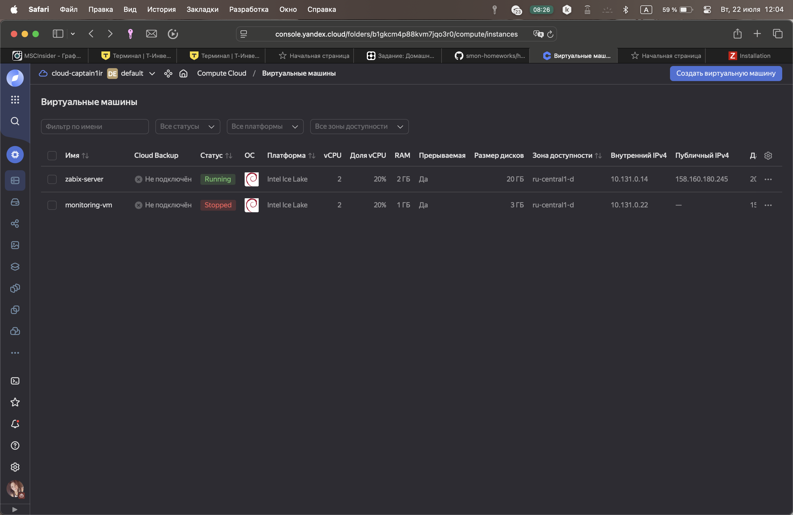

# Домашнее задание к занятию "Системы мониторинга"
### Выполнил: Захаров Роман

---

### Задание 1:

Установите Zabbix Server с веб-интерфейсом.

Процесс выполнения

Выполняя ДЗ, сверяйтесь с процессом отражённым в записи лекции.
Установите PostgreSQL. Для установки достаточна та версия, что есть в системном репозитороии Debian 11.
Пользуясь конфигуратором команд с официального сайта, составьте набор команд для установки последней версии Zabbix с поддержкой PostgreSQL и Apache.
Выполните все необходимые команды для установки Zabbix Server и Zabbix Web Server.

**Процесс выполнения:**
1.  Была создана виртуальная машина в Yandex.Cloud на базе образа Debian 11.
2.  Настроена группа безопасности для разрешения входящего трафика на порты 22 (SSH) и 80 (HTTP), а также разрешен весь исходящий трафик для доступа ВМ в интернет.
3.  Внутри ВМ были выполнены шаги по установке и настройке PostgreSQL, Zabbix Server, веб-интерфейса и агента.
4.  После решения проблем с доступом к репозиториям Zabbix была успешно установлена версия Zabbix 6.0 LTS.
5.  После установки и запуска всех сервисов была произведена финальная настройка через веб-интерфейс.

---


#### 1. Текст использованных команд

Ниже приведен полный список команд, выполненных на ВМ для установки и настройки Zabbix.

```bash
# 1. Обновление системы
sudo apt update && sudo apt upgrade -y
sudo apt install -y wget

# 2. Установка и настройка PostgreSQL
sudo apt install -y postgresql postgresql-contrib
sudo -u postgres -i
psql
CREATE USER zabbix WITH PASSWORD '3064'; 
CREATE DATABASE zabbix OWNER zabbix;
\q
exit

# 3. Установка репозитория Zabbix 6.0 LTS
wget https://repo.zabbix.com/zabbix/6.0/debian/pool/main/z/zabbix-release/zabbix-release_6.0-4%2Bdebian11_all.deb
sudo dpkg -i zabbix-release_6.0-4+debian11_all.deb
sudo apt update





# 4. Установка пакетов Zabbix
sudo apt install -y zabbix-server-pgsql zabbix-frontend-php zabbix-apache-conf zabbix-sql-scripts zabbix-agent

# 5. Импорт схемы БД Zabbix
zcat /usr/share/zabbix-sql-scripts/postgresql/server.sql.gz | psql -U zabbix -d zabbix -h localhost

# 6. Настройка конфигурационного файла Zabbix Server
# В файле /etc/zabbix/zabbix_server.conf была изменена строка:
# DBPassword=3064

# 7. Запуск и добавление в автозагрузку сервисов
sudo systemctl restart zabbix-server zabbix-agent apache2
sudo systemctl enable zabbix-server zabbix-agent apache2

# 8. Команды для исправления работы Apache, если веб-интерфейс Zabbix не открывается сразу
# sudo a2dissite 000-default.conf
# sudo systemctl restart apache2

