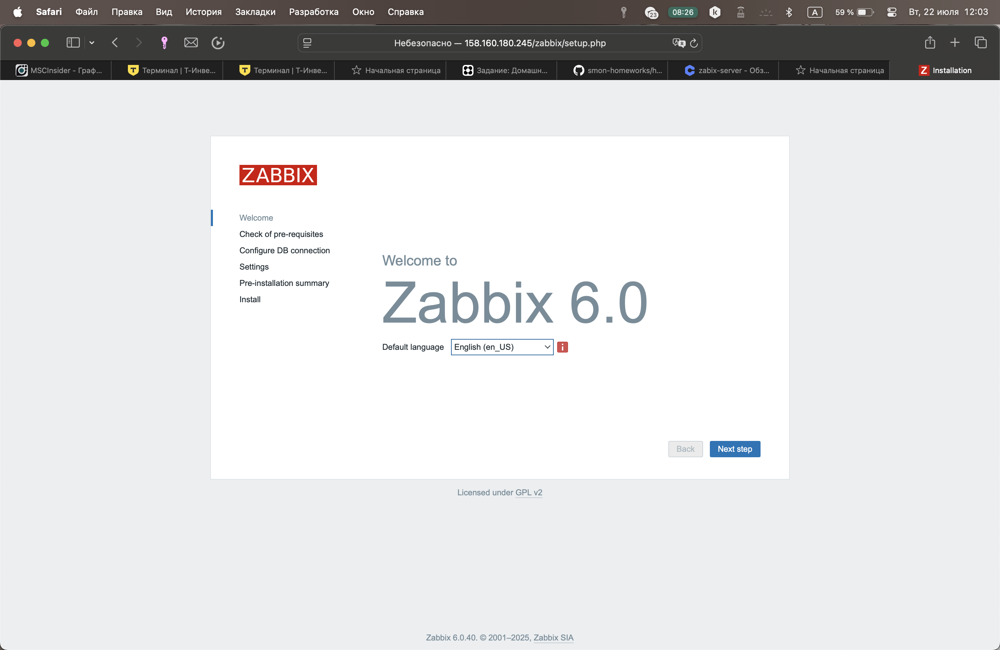

# Домашнее задание к занятию "Системы мониторинга"
### Выполнил: Захаров Роман

---

### Задание 1:

Установите Zabbix Server с веб-интерфейсом.

Процесс выполнения

Выполняя ДЗ, сверяйтесь с процессом отражённым в записи лекции.
Установите PostgreSQL. Для установки достаточна та версия, что есть в системном репозитороии Debian 11.
Пользуясь конфигуратором команд с официального сайта, составьте набор команд для установки последней версии Zabbix с поддержкой PostgreSQL и Apache.
Выполните все необходимые команды для установки Zabbix Server и Zabbix Web Server.

**Процесс выполнения:**
1.  Была создана виртуальная машина в Yandex.Cloud на базе образа Debian 11.
2.  Настроена группа безопасности для разрешения входящего трафика на порты 22 (SSH) и 80 (HTTP), а также разрешен весь исходящий трафик для доступа ВМ в интернет.
3.  Внутри ВМ были выполнены шаги по установке и настройке PostgreSQL, Zabbix Server, веб-интерфейса и агента.
4.  После решения проблем с доступом к репозиториям Zabbix была успешно установлена версия Zabbix 6.0 LTS.
5.  После установки и запуска всех сервисов была произведена финальная настройка через веб-интерфейс.

---




#### 1. Текст использованных команд

Ниже приведен полный список команд, выполненных на ВМ для установки и настройки Zabbix.

```bash
# 1. Обновление системы
sudo apt update && sudo apt upgrade -y
sudo apt install -y wget

# 2. Установка и настройка PostgreSQL
sudo apt install -y postgresql postgresql-contrib
sudo -u postgres -i
psql
CREATE USER zabbix WITH PASSWORD '3064'; 
CREATE DATABASE zabbix OWNER zabbix;
\q
exit

# 3. Установка репозитория Zabbix 6.0 LTS
wget https://repo.zabbix.com/zabbix/6.0/debian/pool/main/z/zabbix-release/zabbix-release_6.0-4%2Bdebian11_all.deb
sudo dpkg -i zabbix-release_6.0-4+debian11_all.deb
sudo apt update


# 4. Установка пакетов Zabbix
sudo apt install -y zabbix-server-pgsql zabbix-frontend-php zabbix-apache-conf zabbix-sql-scripts zabbix-agent

# 5. Импорт схемы БД Zabbix
zcat /usr/share/zabbix-sql-scripts/postgresql/server.sql.gz | psql -U zabbix -d zabbix -h localhost

# 6. Настройка конфигурационного файла Zabbix Server
# В файле /etc/zabbix/zabbix_server.conf была изменена строка:
# DBPassword=3064

# 7. Запуск и добавление в автозагрузку сервисов
sudo systemctl restart zabbix-server zabbix-agent apache2
sudo systemctl enable zabbix-server zabbix-agent apache2

# 8. Команды для исправления работы Apache, если веб-интерфейс Zabbix не открывается сразу
# sudo a2dissite 000-default.conf
# sudo systemctl restart apache2


### Задание 2: Установка Zabbix Agent на два хоста

**** Установите Zabbix Agent на два хоста.

Процесс выполнения

Выполняя ДЗ, сверяйтесь с процессом отражённым в записи лекции.
Установите Zabbix Agent на 2 вирт.машины, одной из них может быть ваш Zabbix Server.
Добавьте Zabbix Server в список разрешенных серверов ваших Zabbix Agentов.
Добавьте Zabbix Agentов в раздел Configuration > Hosts вашего Zabbix Servera.
Проверьте, что в разделе Latest Data начали появляться данные с добавленных агентов.
Требования к результатам

Приложите в файл README.md скриншот раздела Configuration > Hosts, где видно, что агенты подключены к серверу
Приложите в файл README.md скриншот лога zabbix agent, где видно, что он работает с сервером
Приложите в файл README.md скриншот раздела Monitoring > Latest data для обоих хостов, где видны поступающие от агентов данные.
Приложите в файл README.md текст использованных команд в GitHub


**Процесс выполнения:**
1.  Была создана вторая виртуальная машина `agent-host` в Yandex.Cloud в той же подсети, что и `zabbix-server`.
2.  На обеих машинах (`zabbix-server` и `agent-host`) был настроен Zabbix Agent. В конфигурационном файле `zabbix_agentd.conf` были указаны `Server` (IP-адрес Zabbix Server) и `Hostname`.
3.  В веб-интерфейсе Zabbix в разделе `Configuration > Hosts` были созданы/настроены оба хоста.
4.  К каждому хосту был применен шаблон `Linux by Zabbix agent` для автоматического сбора стандартных метрик.
5.  Была проведена проверка доступности агентов, логов и поступления данных.

---

#### 1. Текст использованных команд (на `agent-host`)

```bash
# 1. Установка репозитория Zabbix 6.0 LTS
wget https://repo.zabbix.com/zabbix/6.0/debian/pool/main/z/zabbix-release/zabbix-release_6.0-4%2Bdebian11_all.deb
sudo dpkg -i zabbix-release_6.0-4+debian11_all.deb
sudo apt update

# 2. Установка пакета Zabbix Agent
sudo apt install -y zabbix-agent

# 3. Настройка конфигурационного файла Zabbix Agent
# sudo nano /etc/zabbix/zabbix_agentd.conf
# В файле были изменены следующие строки:
# Server=10.131.0.14 # IP-адрес Zabbix Server
# ServerActive=10.131.0.14 # IP-адрес Zabbix Server
# Hostname=Zabbix-agent-host # Уникальное имя хоста

# 4. Запуск и добавление в автозагрузку сервиса
sudo systemctl restart zabbix-agent
sudo systemctl enable zabbix-agent